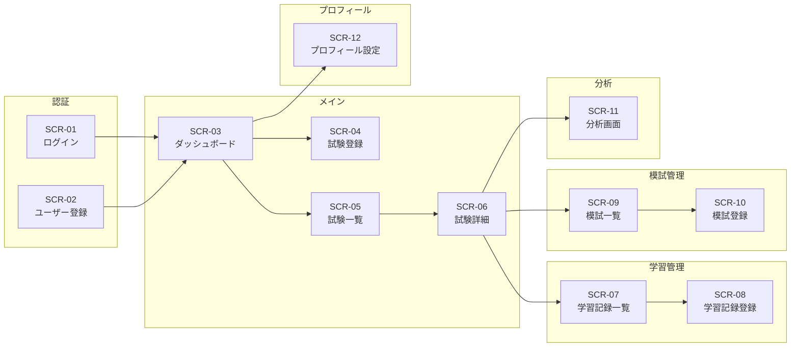

# 画面設計書

## 02_screen_design.md

作成日：2025-02-27

---

# 1. 画面一覧

| 画面ID | 画面名         | URL                       | 認証 | 概要                 |
| ------ | -------------- | ------------------------- | ---- | -------------------- |
| SCR-01 | ログイン       | /login                    | 不要 | ユーザーログイン画面 |
| SCR-02 | ユーザー登録   | /register                 | 不要 | 新規登録画面         |
| SCR-03 | ダッシュボード | /exams                    | 必須 | ログイン後トップ画面 |
| SCR-04 | 試験登録       | /exams/create             | 必須 | 試験新規登録         |
| SCR-05 | 試験一覧       | /exams/list               | 必須 | 試験一覧・横断サマリー |
| SCR-06 | 試験詳細       | /exams/{id}               | 必須 | 試験ダッシュボード   |
| SCR-07 | 学習記録一覧   | /exams/{id}/study-records | 必須 | 学習記録一覧         |
| SCR-08 | 学習記録登録   | /exams/{id}/study-records/create | 必須 | 学習記録登録画面 |
| SCR-09 | 模試一覧       | /exams/{id}/mock-exams    | 必須 | 模試一覧表示         |
| SCR-10 | 模試登録       | /exams/{id}/mock-exams/create | 必須 | 模試登録画面     |
| SCR-11 | 分析画面       | /exams/{id}/analysis      | 必須 | グラフ表示画面       |
| SCR-12 | プロフィール設定 | /profile                | 必須 | アカウント設定画面   |

---

# 2. 画面遷移図

---

# 3. 各画面詳細

---

## SCR-01 ログイン画面

### 1. 概要

既存ユーザーがログインするための画面。

### 2. 入力項目

| 項目名         | 型       | 必須 | 備考         |
| -------------- | -------- | ---- | ------------ |
| メールアドレス | email    | ○    | 形式チェック |
| パスワード     | password | ○    |              |

### 3. ボタン

- ログイン
- 新規登録画面へのリンク

### 4. 正常系

- 認証成功時、ダッシュボードへ遷移

### 5. 異常系

- 認証失敗時、エラーメッセージ表示

---

## SCR-02 ユーザー登録画面

### 1. 概要

新規ユーザーを登録する画面。

### 2. 入力項目

| 項目名         | 型       | 必須 | 備考        |
| -------------- | -------- | ---- | ----------- |
| 名前           | text     | ○    | 100文字以内 |
| メールアドレス | email    | ○    | 一意制約    |
| パスワード     | password | ○    | 8文字以上   |
| パスワード確認 | password | ○    | 一致確認    |

### 3. 正常系

- 登録成功後、ダッシュボードへ遷移

---

## SCR-03 ダッシュボード

### 1. 概要

ログイン後のトップ画面。試験作成や試験一覧への導線を表示する。

### 2. 表示項目

| 項目             | 内容                     |
| ---------------- | ------------------------ |
| 試験を作成       | 試験登録画面への導線     |
| 試験一覧を見る   | 試験一覧画面への導線     |
| プロフィール     | プロフィール設定への導線 |

### 3. 機能

- 試験登録画面への遷移
- 試験一覧画面への遷移
- プロフィール設定画面への遷移

---

## SCR-04 試験登録画面

### 1. 概要

新規試験を登録する画面。

### 2. 入力項目

| 項目名     | 型     | 必須 | 備考           |
| ---------- | ------ | ---- | -------------- |
| 試験名     | text   | ○    | 255文字以内    |
| 試験日     | date   | ○    |                |
| 合格基準点 | number | 任意 | 0以上          |
| 目標得点   | number | 任意 | 合格基準点以上 |

### 3. 正常系

- 登録後、ダッシュボードへ遷移

---

## SCR-05 試験一覧画面

### 1. 概要

登録済み試験を一覧表示し、試験横断の学習サマリーを表示する。

### 2. 表示内容

- 全試験合計の学習時間
- 全試験合計の学習日数
- 直近7日の学習グラフ
- 試験カード一覧

### 3. 機能

- 試験詳細画面への遷移
- 模試一覧画面への遷移
- 模試登録画面への遷移
- 試験編集 / 削除

---

## SCR-06 試験詳細画面

### 1. 概要

対象試験のメニュー画面。

### 2. 表示内容

- 試験日
- 合格基準点
- 目標得点
- 学習記録一覧へのリンク
- 模試一覧へのリンク
- 分析画面へのリンク
- 最新模試得点
- 合格基準との差
- 目標得点との差

---

## SCR-07 学習記録一覧画面

### 1. 概要

試験単位で学習記録を一覧表示する。

### 2. 表示項目

| 項目     | 内容       |
| -------- | ---------- |
| 学習日   | YYYY-MM-DD |
| 科目     | 入力値     |
| 学習時間 | 分         |
| メモ     | 任意       |
| 編集     | ボタン     |
| 削除     | ボタン     |

### 3. 並び順

- 学習日降順

---

## SCR-08 学習記録登録画面

### 1. 概要

学習記録を登録する画面。

### 2. 入力項目

| 項目名         | 型       | 必須 | 備考         |
| -------------- | -------- | ---- | ------------ |
| 学習日         | date     | ○    |              |
| 科目           | text     | ○    | 100文字以内  |
| 学習時間（分） | number   | ○    | 1以上        |
| 学習内容メモ   | textarea | 任意 | 1000文字以内 |

### 3. 正常系

- 登録後、学習記録一覧へ遷移

---

## SCR-09 模試一覧画面

### 1. 概要

試験単位で模試結果を一覧表示する。

### 2. 表示項目

| 項目   | 内容       |
| ------ | ---------- |
| 模試名 | 入力値     |
| 受験日 | YYYY-MM-DD |
| 総合点 | 数値       |
| 偏差値 | 数値       |
| 編集   | ボタン     |
| 削除   | ボタン     |

### 3. 並び順

- 受験日昇順

---

## SCR-10 模試登録画面

### 1. 概要

模試結果を登録する画面。

### 2. 入力項目

| 項目名 | 型     | 必須 |
| ------ | ------ | ---- |
| 模試名 | text   | ○    |
| 受験日 | date   | ○    |
| 総合点 | number | ○    |
| 偏差値 | number | 任意 |

### 3. 科目別得点（複数入力可）

| 項目名 | 型     | 必須 |
| ------ | ------ | ---- |
| 科目名 | text   | ○    |
| 得点   | number | ○    |

### 4. 正常系

- 登録後、模試一覧へ遷移

---

## SCR-11 分析画面

### 1. 概要

試験単位で各種分析グラフを表示する。

### 2. 表示内容

- 月別学習時間（棒グラフ）
- 直近7日の学習時間
- 継続指標
- 最新模試の科目別レーダー
- 模試総合点推移（折れ線グラフ）
- 科目別学習時間
- 合格基準点 / 目標得点の基準線表示

### 3. データ範囲

- 当該試験に紐づくデータのみ表示

---

## SCR-12 プロフィール設定画面

### 1. 概要

ユーザーの基本情報、学習目標、パスワード変更、退会を行う画面。

### 2. 入力項目

| 項目名                   | 型       | 必須 | 備考             |
| ------------------------ | -------- | ---- | ---------------- |
| 名前                     | text     | ○    | 255文字以内      |
| メールアドレス           | email    | ○    | 一意制約         |
| 週間学習目標日数         | number   | 任意 | 1〜7             |
| 1日の目標学習時間（分）  | number   | 任意 | 1〜1440          |
| 現在のパスワード         | password | ○    | パスワード変更時 |
| 新しいパスワード         | password | ○    | パスワード変更時 |

### 3. 機能

- 基本情報更新
- 学習目標更新
- パスワード変更
- 退会
