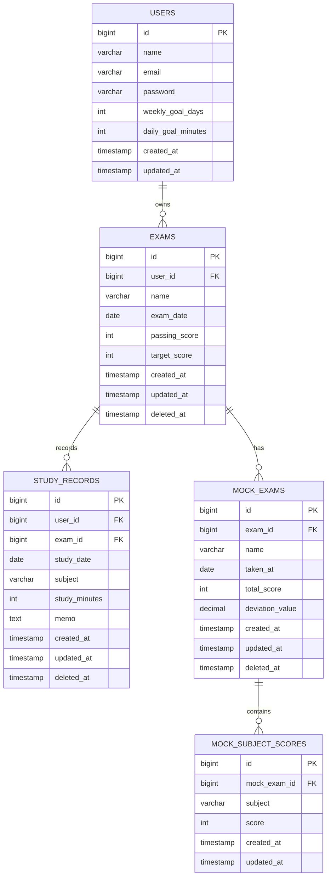

# 03. データベース設計

---

# 1. ER図

```mermaid
erDiagram

    USERS ||--o{ EXAMS : owns
    EXAMS ||--o{ STUDY_RECORDS : records
    EXAMS ||--o{ MOCK_EXAMS : has
    MOCK_EXAMS ||--o{ MOCK_SUBJECT_SCORES : contains

    USERS {
        bigint id PK
        varchar name
        varchar email
        varchar password
        int weekly_goal_days
        int daily_goal_minutes
        timestamp created_at
        timestamp updated_at
    }

    EXAMS {
        bigint id PK
        bigint user_id FK
        varchar name
        date exam_date
        int passing_score
        int target_score
        timestamp created_at
        timestamp updated_at
        timestamp deleted_at
    }

    STUDY_RECORDS {
        bigint id PK
        bigint user_id FK
        bigint exam_id FK
        date study_date
        varchar subject
        int study_minutes
        text memo
        timestamp created_at
        timestamp updated_at
        timestamp deleted_at
    }

    MOCK_EXAMS {
        bigint id PK
        bigint exam_id FK
        varchar name
        date taken_at
        int total_score
        decimal deviation_value
        timestamp created_at
        timestamp updated_at
        timestamp deleted_at
    }

    MOCK_SUBJECT_SCORES {
        bigint id PK
        bigint mock_exam_id FK
        varchar subject
        int score
        timestamp created_at
        timestamp updated_at
    }
```
