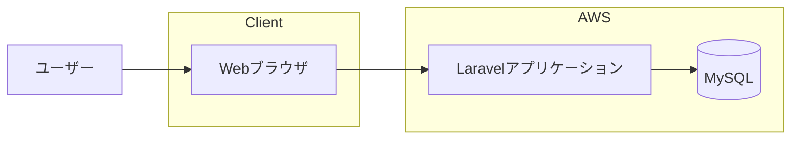

# 04. システム構成設計

---

# 1. システム概要

本システムは、学習進捗管理および模試分析を目的としたWebアプリケーションである。

ユーザーはブラウザからアクセスし、以下の機能を利用できる。

- 学習記録の登録・閲覧
- 模試結果の登録・閲覧
- 学習時間の分析
- 得点推移の可視化

---

# 2. システム全体構成

## 2.1 構成概要

- フロントエンド：Blade + Vue（部分導入）
- バックエンド：Laravel
- データベース：MySQL
- デプロイ先：AWS（予定）

---

## 2.2 システム構成図

---

# 3. アーキテクチャ概要

## 3.1 採用アーキテクチャ

| 項目               | 内容                   |
| ------------------ | ---------------------- |
| アーキテクチャ方式 | MVC                    |
| フロント構成       | Blade + Vue（部分SPA） |
| API方式            | 一部JSON API           |
| データ形式         | JSON                   |
| ORM                | Eloquent               |

---

## 3.2 レイヤー構成

### 3.2.1 プレゼンテーション層

| 項目                 | 内容                           |
| -------------------- | ------------------------------ |
| テンプレートエンジン | Blade                          |
| フロント拡張         | Vue.js                         |
| グラフ描画           | Chart.js                       |
| 主な責務             | 画面表示、入力受付、グラフ描画 |

#### 責務詳細

- 画面レンダリング
- フォーム入力制御
- 分析データの可視化
- API通信（分析画面のみ）

---

### 3.2.2 アプリケーション層

| 項目           | 内容                 |
| -------------- | -------------------- |
| フレームワーク | Laravel              |
| 構造           | Controller / Service |
| ORM            | Eloquent             |
| 認証           | Laravel標準認証      |

#### 責務詳細

- リクエスト受付
- バリデーション
- ビジネスロジック処理
- データベースアクセス
- レスポンス生成（HTML / JSON）

---

### 3.2.3 データ層

| 項目             | 内容             |
| ---------------- | ---------------- |
| DBMS             | MySQL            |
| 永続化方式       | RDB              |
| トランザクション | ACID準拠         |
| 制約             | PK / FK / UNIQUE |

---

# 4. フロントエンド構成

## 4.1 Blade中心構成

- 通常画面はBladeでサーバーサイドレンダリング
- フルSPAは採用しない

## 4.2 Vue部分導入

対象画面：

- 分析画面（グラフ表示部分）

## 4.3 Chart.js利用

用途：

- 月別学習時間（棒グラフ）
- 科目別学習割合（円グラフ）
- 得点推移（折れ線グラフ）

---

# 5. 認証設計

| 項目           | 内容             |
| -------------- | ---------------- |
| 認証方式       | Laravel標準認証  |
| セッション管理 | Cookie           |
| パスワード管理 | bcryptハッシュ化 |
| CSRF対策       | Laravel標準機能  |

---

# 6. データフロー

## 6.1 通常画面処理

1. ユーザー操作
2. Controllerがリクエスト受信
3. モデル経由でDBアクセス
4. Bladeへデータ渡し
5. HTML生成・表示

## 6.2 分析画面処理

1. 画面ロード
2. VueがAPIを呼び出す
3. JSONデータ取得
4. Chart.jsで描画

---

# 7. インフラ構成（AWS予定）

| 項目           | 内容           |
| -------------- | -------------- |
| クラウド       | AWS            |
| アプリ実行環境 | EC2 または ECS |
| データベース   | RDS（MySQL）   |
| ストレージ     | S3（将来拡張） |
| SSL            | ACM            |

---

# 8. 可用性設計

| 項目           | 方針               |
| -------------- | ------------------ |
| アプリ構成     | ステートレス設計   |
| DBバックアップ | 日次バックアップ   |
| 将来拡張       | オートスケール可能 |

---

# 9. セキュリティ設計

| 項目                | 対応内容            |
| ------------------- | ------------------- |
| SQLインジェクション | Eloquent利用        |
| XSS対策             | Blade自動エスケープ |
| CSRF対策            | Laravel標準機能     |
| パスワード保護      | ハッシュ化保存      |

---
