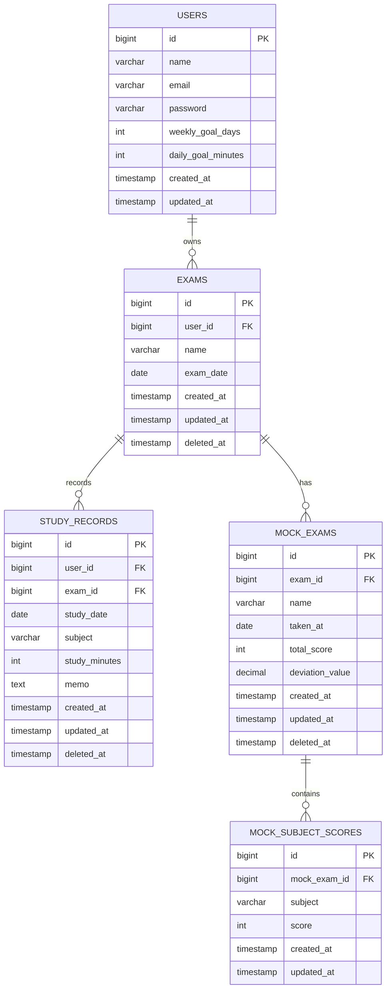

# 06. データベース設計（ER図＋物理設計）

---

# 1. 設計方針

- データベース：MySQL
- 正規化：MVPのため一部非正規化（科目は文字列管理）
- 主キー：BIGINT AUTO_INCREMENT
- 外部キー制約：設定する
- 論理削除：Laravel標準の softDeletes を利用
- 文字コード：utf8mb4
- 学習記録と模試は試験単位で管理する
- プロフィール設定はユーザー単位で管理する

---

# 2. ER図（論理構造）

## ■ エンティティ一覧

- users（ユーザー）
- exams（試験）
- study_records（学習記録）
- mock_exams（模試）
- mock_subject_scores（模試科目別得点）

---

## ■ ER関係図（Mermaid）



---

# 3. テーブル定義（物理設計）

---

## 3.1 users

| カラム名   | 型           | 制約     | 説明           |
| ---------- | ------------ | -------- | -------------- |
| id         | BIGINT       | PK       | ユーザーID     |
| name       | VARCHAR(255) | NOT NULL | ユーザー名     |
| email      | VARCHAR(255) | UNIQUE   | メールアドレス |
| password   | VARCHAR(255) | NOT NULL | パスワード     |
| weekly_goal_days | INT    | NULL可   | 週間学習目標日数 |
| daily_goal_minutes | INT  | NULL可   | 1日の目標学習時間（分） |
| created_at | TIMESTAMP    |          | 作成日時       |
| updated_at | TIMESTAMP    |          | 更新日時       |

---

## 3.2 exams（試験）

| カラム名   | 型           | 制約         | 説明       |
| ---------- | ------------ | ------------ | ---------- |
| id         | BIGINT       | PK           | 試験ID     |
| user_id    | BIGINT       | FK(users.id) | ユーザーID |
| name       | VARCHAR(255) | NOT NULL     | 試験名     |
| exam_date  | DATE         | NULL可       | 試験日     |
| passing_score | INT       | NULL可       | 合格基準点 |
| target_score  | INT       | NULL可       | 目標得点   |
| created_at | TIMESTAMP    |              | 作成日時   |
| updated_at | TIMESTAMP    |              | 更新日時   |
| deleted_at | TIMESTAMP    | NULL可       | 論理削除   |

---

## 3.3 study_records（学習記録）

| カラム名      | 型           | 制約         | 説明             |
| ------------- | ------------ | ------------ | ---------------- |
| id            | BIGINT       | PK           | 学習記録ID       |
| user_id       | BIGINT       | FK(users.id) | ユーザーID       |
| exam_id       | BIGINT       | FK(exams.id) | 試験ID           |
| study_date    | DATE         | NOT NULL     | 学習日           |
| subject       | VARCHAR(100) | NOT NULL     | 科目名（文字列） |
| study_minutes | INT          | NOT NULL     | 学習時間（分）   |
| memo          | TEXT         | NULL可       | メモ             |
| created_at    | TIMESTAMP    |              | 作成日時         |
| updated_at    | TIMESTAMP    |              | 更新日時         |
| deleted_at    | TIMESTAMP    | NULL可       | 論理削除         |

---

## 3.4 mock_exams（模試）

| カラム名        | 型           | 制約         | 説明     |
| --------------- | ------------ | ------------ | -------- |
| id              | BIGINT       | PK           | 模試ID   |
| exam_id         | BIGINT       | FK(exams.id) | 試験ID   |
| name            | VARCHAR(255) | NOT NULL     | 模試名   |
| taken_at        | DATE         | NOT NULL     | 受験日   |
| total_score     | INT          | NULL可       | 総合点   |
| deviation_value | DECIMAL(5,2) | NULL可       | 偏差値   |
| created_at      | TIMESTAMP    |              | 作成日時 |
| updated_at      | TIMESTAMP    |              | 更新日時 |
| deleted_at      | TIMESTAMP    | NULL可       | 論理削除 |

---

## 3.5 mock_subject_scores（模試科目別得点）

| カラム名     | 型           | 制約              | 説明             |
| ------------ | ------------ | ----------------- | ---------------- |
| id           | BIGINT       | PK                | 得点ID           |
| mock_exam_id | BIGINT       | FK(mock_exams.id) | 模試ID           |
| subject      | VARCHAR(100) | NOT NULL          | 科目名（文字列） |
| score        | INT          | NOT NULL          | 得点             |
| created_at   | TIMESTAMP    |                   | 作成日時         |
| updated_at   | TIMESTAMP    |                   | 更新日時         |

---

# 4. インデックス設計

| テーブル            | インデックス          | 理由                 |
| ------------------- | --------------------- | -------------------- |
| exams               | user_id               | ユーザー別取得高速化 |
| study_records       | (exam_id, study_date) | 試験別期間検索高速化 |
| study_records       | user_id               | ユーザー別取得高速化 |
| study_records       | subject               | 科目別集計           |
| mock_exams          | (exam_id, taken_at)   | 試験別時系列取得     |
| mock_subject_scores | subject               | 科目別推移表示       |

---

# 5. 集計想定クエリ例

## 月別学習時間

```sql
SELECT MONTH(study_date) AS month,
       SUM(study_minutes) AS total_minutes
FROM study_records
WHERE exam_id = ?
  AND YEAR(study_date) = ?
GROUP BY MONTH(study_date);
```

---

## 科目別学習時間

```sql
SELECT subject,
       SUM(study_minutes) AS total_minutes
FROM study_records
WHERE exam_id = ?
  AND study_date BETWEEN ? AND ?
GROUP BY subject;
```

---

# 6. 将来的拡張想定

- 科目マスターテーブル追加（subject正規化）
- 合格スコアカラム追加
- AI予測テーブル追加

---

# 7. データ整合性設計

- 外部キー制約による整合性確保
- ON DELETE CASCADE は使用しない（論理削除で管理）
- トランザクションはLaravel標準機能を利用
- 科目は文字列のため表記ゆれ対策はアプリ側で制御する
